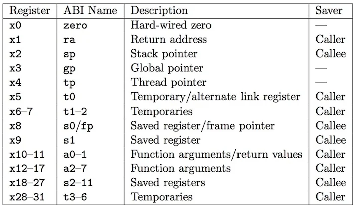

## RISC - Reduced Instruction Set Computer

RISC is a computer architecture proposed in the early 1980s based on simplicity.

RISC CPUs have lots of registers and a modest core instruction set. This modularity means that a RISC-V implementation is composed of a mandatory base ISA and a number of ISA extensions so that custom CPUs may be tailored to the needs of the application. Any extension can be used or left out for a specific implementation. 

RISC-V came out in 2010.

## Privileged Levels

From least to most privileged:

-User Mode(U mode) for user processes.
-Supervisor Mode(S mode) for kernel and/or device drivers.
-Machine Mode(M mode) for bootloader and/or firmware.

## RV32I Base Integer ISA
Add, Sub, Bitwise logical operations, load and store, jumps and branches.

## ABI

