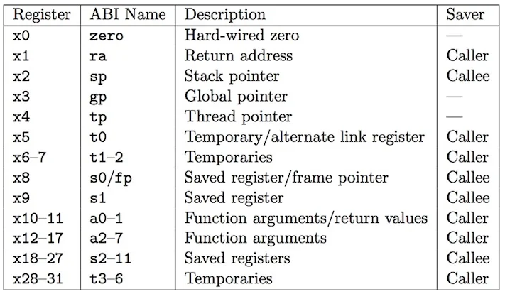

## RISC - Reduced Instruction Set Computer

RISC is a computer architecture proposed in the early 1980s based on simplicity.

RISC CPUs have lots of registers and a modest core instruction set. This modularity means that a RISC-V implementation is composed of a mandatory base ISA and a number of ISA extensions so that custom CPUs may be tailored to the needs of the application. Any extension can be used or left out for a specific implementation. 

RISC-V came out in 2010.

Es little endian.

All instructions are encoded in the same length*

## Flashero
There is no Stack Pointer. RISC-V itself does not specify a predefined stack pointer register. While most architectures like x86, MIPS, and ARM include a dedicated stack pointer register, the choice of which register to use as the stack pointer in RISC-V is determined by the ABI (Application Binary Interface). 

Technically, any register other than x0 can be used as a stack pointer.

There are no push nor pop instructions. 

Stack operations are typically achieved using a combination of load and store instructions, in conjunction with additions, subtractions, and the stack pointer (as defined by the ABI).

There are no subroutine call or return instructions. This is very similar to the previous features above: Subroutine call and return instructions are available as pseudoinstructions, which are performed by jump-and-link instructions.

## Privileged Levels

From least to most privileged:

-User Mode(U mode) for user processes.
-Supervisor Mode(S mode) for kernel and/or device drivers.
-Machine Mode(M mode) for bootloader and/or firmware.

## RV32I Base Integer ISA
Add, Sub, Bitwise logical operations, load and store, jumps and branches.

## ABI

